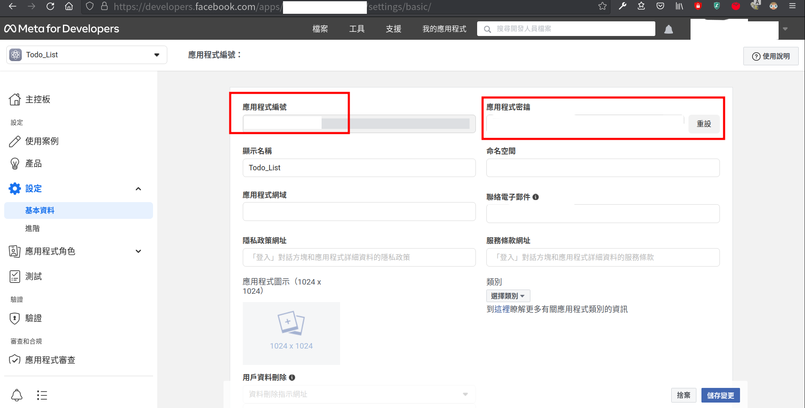

# coffee_shop
打造可上線的咖啡豆專賣網頁，採前後端分離開發，此頁面為後端Github
- [前端Github](https://github.com/ailsayang999/coffee-shop)
- [上線體驗網址(部署於Vercel)](https://github.com/ailsayang999/coffee-shop)

## Demo

>主畫面展示


## 目錄
- [功能](#功能)
- [安裝](#安裝)
    - [取得環境變數](#取得環境變數)
- [使用套件](#使用套件)
- [貢獻者](#貢獻者)

## 功能
- 瀏覽所有商品
- 全站打折活動依照預設時間範圍自動出現在主畫面
- 所有商品可於打折期間展出原價與打折後價格
- 商品可加入購物車
- 購物車商品可於結帳頁面結帳，並依照提供之email寄送確認信函

## 安裝
1. 請先確認有安裝 node.js 與 npm
2. 創造一個專案資料夾，打開您的 terminal，使用`cd`指令進入您剛創建的資料夾
3. Clone 此專案至本機電腦將專案 clone 到本地
    ```shell
    git clone https://github.com/TinyMurky/coffee_shop.git
    ```
4. CD進入您剛剛建立的資料夾，輸入以下指令自動安裝所需套件
    ```shell
    npm install
    ```
5. 您需要先[安裝MySQL](https://dev.mysql.com/doc/mysql-getting-started/en/)，隨後進入本專案`/config/config.json`中`development`的username與password改成您於MySQL的設定值(可以使用root帳號)。

6. 資料庫連線完畢後，依照在終端機中輸入以下指令建立database:
    ```shell
    npm run build_db
    ```
7. 接著建立種子資料
    ```shell
    npm run build_sql
    ```
    若建立失敗可用以下指令刪除種子資料
    ```shell
    npm run purge_sql
    ```
8. 請依照以下[取得環境變數](#取得環境變數)將環境變數填寫至`.env.example`之後將檔名改為`.env`

9. 使用以下指令啟動
    ```shell
    npm run start
    ```

### 取得環境變數
本專案目前預留Passport做未來會員系統登入使用。因此需要Google 與 Facebook的 OAuth2 Secret Key
- JWT_SECRET請隨意填寫您喜歡的英數混雜字串
- GOOGLE_CLIENT_ID, GOOGLE_CLIENT_SECRET請於 [Google Developers Console](https://console.cloud.google.com/projectselector2/apis/dashboard?pli=1&supportedpurview=project)申請一組OAuth 2.0用戶端ID與金鑰，設定時`已授權的重新導向URI`請填寫`http://localhost:3000/api/auth/google/callback`
- GOOGLE_CALLBACK請填寫`http://localhost:3001/api/auth/google/callback`

- FACEBOOK_APP_ID, FACEBOOK_APP_SECRET 請於[meta for developer](https://developers.facebook.com/)申請一組應用程式編號與應用程式密鑰


- FACEBOOK_CALLBACK請填寫`http://localhost:3001/api/auth/facebook/callback`

- GOOGLE_SMTP_MAIL請填寫您的Gmail信箱
- GOOGLE_SMTP_PASSWORD請依照以下步驟申請gmail應用程式密碼
    - 先前往google帳戶的設定區[Google帳戶](https://myaccount.google.com/)
    

    - 要開啟兩步驟驗證
    

    - 接著滑到最下面開啟應用程式密碼
    
    

    - 把以下密碼放到`.env`的`GOOGLE_SMTP_PASSWORD`裡
    

- 於bash中開啟node, 請依照以下指令生成CRYPO_SECRET_KEY
    ```
    const crypto = require('crypto')
    crypto.randomBytes(32).toString('hex')
    ```

- 於bash中開啟node, 請依照以下指令生成CRYPO_SECRET_IV
    ```
    const crypto = require('crypto')
    crypto.randomBytes(16).toString('hex')
    ```

## 使用套件

### 主環境

| Package | version |
| :--- | :--- |
| Node.js | v20.5.1 |
| express | v4.18.2 |

### 資料庫

| Package | version |
| :--- | :--- |
| mysql2 | v3.6.1 |
| sequelize | v6.33.0 |
| sequelize-cli | v6.6.1 |

### 登入功能

| Package | version |
| :--- | :--- |
| passport | v0.6.0 |
| passport-facebook | v1.0.0 |
| passport-facebook | v3.0.0 |
| passport-facebook-token | v4.0.0 |
| passport-google-oauth20" | v2.0.0 |
| passport-jwt" | v4.0.1 |
| jsonwebtoken | v9.0.2 |
| bcryptjs | v2.4.3 |

### 郵件處理

| Package | version |
| :--- | :--- |
| email-validator | v2.0.4 |
| nodemailer | v6.9.7 |

### 其他

| Package | version |
| :--- | :--- |
| cors | v2.8.5 |
| dotenv | v16.3.1 |
| method-override | v3.0.0 |

### 程式碼風格

| Package | version |
| :--- | :--- |
| eslint | v8.51.0 |

## 貢獻者
### 後端
[seangotjuice](https://github.com/seangotjuice) | [TinyMurky](https://github.com/TinyMurky)

### 前端
[ailsayang999](https://github.com/ailsayang999/coffee-shop)